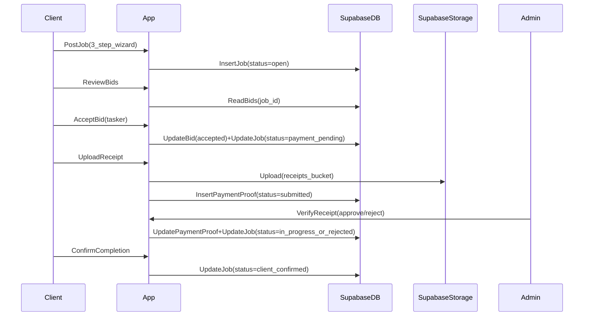

# Wok Konek MVP (Next.js 16 + Supabase) Build Plan

## Product decisions locked

- **Routing**: Next.js 16 App Router
- **UI**: Tailwind only (light-first, logo-inspired)
- **Auth**: email/password, **skip email verification** for MVP
- **Pricing**: fixed-price jobs
- **Geography**: structured Province/District
- **Categories**: fixed list, admin-managed
- **Commission**: 25% of job amount (configurable later)
- **Completion**: requires client confirmation
- **Payments**: manual BSP transfer + receipt upload (JPG/PNG/PDF) + admin verification gate
- **Admin model**: Option A (`profiles.role = 'admin'`)

## High-level flow (Airtasker-like, adapted)

## Status model (enforced server-side + via RLS)

- **Job status**: `open → assigned → payment_pending → payment_submitted → (payment_verified | payment_rejected) → in_progress → tasker_completed → client_confirmed`
- **Bid status**: `submitted → accepted / rejected / withdrawn`
- **Payment proof status**: `submitted → verified / rejected`

## Phase 0 — Repo + Next.js foundation (install first)

### Deliverables

- Next.js 16 App Router app skeleton, Tailwind configured, light-first theme tokens wired.

### Steps

- Initialize Next.js app (TypeScript + ESLint).
- Install packages:
  - `@supabase/supabase-js`, `@supabase/ssr`
  - `zod`
  - `react-hook-form`, `@hookform/resolvers`
- Add baseline app structure:
  - `app/(marketing)/page.tsx` (client-first landing)
  - `app/(auth)/*` (sign-in/sign-up/role)
  - `app/(client)/*`, `app/(tasker)/*`, `app/(admin)/*`
  - `lib/supabase/*` (server/client Supabase helpers)
  - `lib/auth/*` (role guards + session helpers)
- Theme (light-first) using CSS variables + Tailwind mapping:
  - Primary: orange (client CTA)
  - Secondary: teal (tasker CTA)
  - Accent: blue
  - Status colors: success/warn/danger

## Phase 1 — Supabase real project setup (via MCP)

### Goal

- Real Supabase project ready **before** feature work: schema + RLS + Storage.

### Steps

- Discover target Supabase org/project:
  - List organizations
  - List projects
  - If project doesn’t exist, create it (choose region) and wait until ready
- Fetch connection info for the app:
  - Project URL
  - Publishable/anon key (store as Vercel + local env)
- Create Storage bucket:
  - `receipts` bucket **private**
  - Plan for signed URLs for viewing/downloading receipts
- Apply DB migrations (DDL) in a single ordered migration set:
  - Core tables:
    - `profiles` (user_id PK/FK to auth.users, role, status, display_name, phone)
    - `categories` (admin-managed)
    - `provinces`, `districts` (districts FK to provinces)
    - `jobs` (client_id, category_id, province_id, district_id, fixed_price, status, assigned_tasker_id)
    - `bids` (job_id, tasker_id, amount, message, status)
    - `payment_proofs` (job_id, uploader_id, storage_path, mime_type, amount, status, verified_by, verified_at, reject_reason)
    - `job_updates` (job_id, author_id, message, created_at)
    - `admin_actions` (admin_id, action_type, entity_type, entity_id, metadata, created_at)
  - Indexes for list pages (jobs by status/location/category; bids by job; proofs by status)
  - Enum types for statuses (or check constraints)
- Seed data:
  - Initial categories (admin editable)
  - PNG provinces + districts dataset (store as seed SQL; reviewable)
- RLS policies:
  - `profiles`: user can read/update own profile; admin can read all
  - `jobs`: client can CRUD own jobs (with transition constraints); taskers can read `open` jobs; assigned tasker can read assigned job
  - `bids`: taskers can create bids on `open` jobs; client can read bids on own job; only one accepted bid per job
  - `payment_proofs`: client can create for own job when status `payment_pending`; admin can verify/reject
  - `job_updates`: assigned tasker can create updates when job `in_progress`; client can read updates on own job
  - `categories/provinces/districts`: read for all authenticated; write for admin only

## Phase 2 — Deploy early to Vercel (checkpoint)

### Goal

- Confirm real production pipeline works **before** building full marketplace.

### Steps

- Minimal production-ready pages:
  - Landing page + auth pages
  - Role selection + profile creation
  - Empty dashboards per role with guards
- Configure Vercel project:
  - Set env vars: `NEXT_PUBLIC_SUPABASE_URL`, `NEXT_PUBLIC_SUPABASE_ANON_KEY`
- Verify in prod:
  - Build succeeds
  - Sign up/in works
  - After login, user lands on correct dashboard by role

## Phase 3 — Marketplace core (Airtasker-like)

### Client

- Job posting wizard (3 steps): describe → category + province/district → fixed price → publish (`open`)
- Job detail: list bids; accept one bid

### Tasker

- Browse jobs (filters: category + province/district)
- Submit bid (amount + message)

### Server actions

- All writes via server actions calling Supabase directly, relying on RLS for enforcement.

## Phase 4 — Manual BSP payments + admin verification gate

- Client sees BSP instructions at `payment_pending`
- Client uploads receipt (JPG/PNG/PDF): store in private bucket + create `payment_proofs` row → `payment_submitted`
- Admin dashboard:
  - Verification queue: approve/reject with reason
  - On approve: job moves to `in_progress`
  - On reject: job moves to `payment_rejected` and client can re-upload

## Phase 5 — Progress + completion (client confirmation)

- Tasker posts updates while `in_progress`
- Tasker marks `tasker_completed`
- Client confirms completion → `client_confirmed`

## Phase 6 — Admin essentials

- Category management CRUD
- Location management (view + possibly CRUD; seed remains source of truth)
- User suspend (toggle in `profiles.status`)
- Commission display:
  - Store commission rate (default 25%)
  - Display on job/payment screens as breakdown (no escrow in MVP)

## Phase 7 — Hardening (production readiness)

- Upload limits (size/type), signed URL expiration strategy
- Status transition validation (prevent skipping steps)
- Rate limiting (bids, uploads) at app layer
- Audit trail: write `admin_actions` for verify/reject/suspend/category changes
- Performance: paginated lists, minimal JS, cached public landing

## Key implementation files (expected)

- `app/(marketing)/page.tsx`
- `app/(auth)/sign-in/page.tsx`, `app/(auth)/sign-up/page.tsx`, `app/(auth)/choose-role/page.tsx`
- `app/(client)/dashboard/page.tsx`, `app/(client)/jobs/new/*`, `app/(client)/jobs/[id]/page.tsx`
- `app/(tasker)/dashboard/page.tsx`, `app/(tasker)/jobs/page.tsx`, `app/(tasker)/jobs/[id]/page.tsx`
- `app/(admin)/dashboard/page.tsx`, `app/(admin)/payments/page.tsx`, `app/(admin)/categories/page.tsx`, `app/(admin)/locations/page.tsx`
- `lib/supabase/server.ts`, `lib/supabase/client.ts`
- `lib/auth/guards.ts` (role checks)

## Milestone acceptance criteria

- **After Phase 2**: live on Vercel, auth + role dashboards working against real Supabase
- **After Phase 4**: end-to-end job lifecycle through admin payment verification works in prod
- **After Phase 5**: completion requires client confirmation and is auditable

