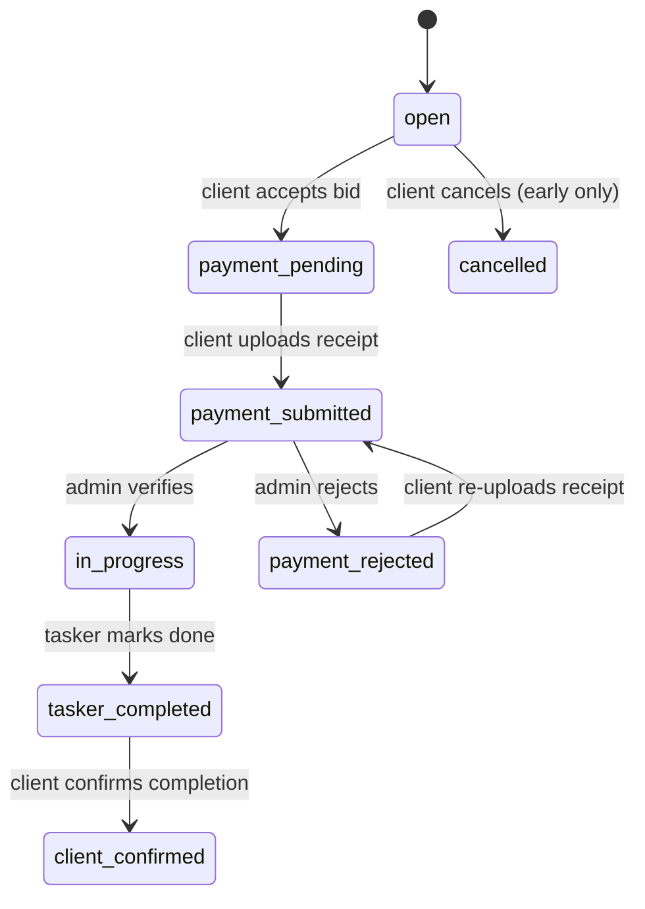
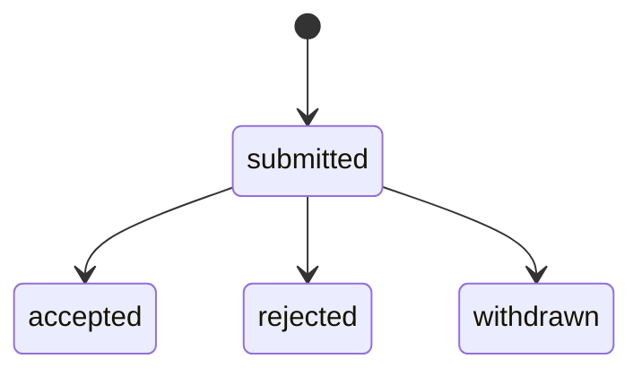
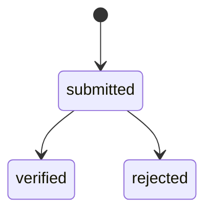

# Status flow (MVP)

## Job lifecycle

```mermaid
stateDiagram-v2
  [*] --> open
  open --> payment_pending: client accepts bid
  payment_pending --> payment_submitted: client uploads receipt
  payment_submitted --> in_progress: admin verifies
  payment_submitted --> payment_rejected: admin rejects
  payment_rejected --> payment_submitted: client re-uploads receipt
  in_progress --> tasker_completed: tasker marks done
  tasker_completed --> client_confirmed: client confirms completion
  open --> cancelled: client cancels (early only)
```

## Bid lifecycle

```mermaid
stateDiagram-v2
  [*] --> submitted
  submitted --> accepted
  submitted --> rejected
  submitted --> withdrawn
```

## Payment proof lifecycle

```mermaid
stateDiagram-v2
  [*] --> submitted
  submitted --> verified
  submitted --> rejected
```

